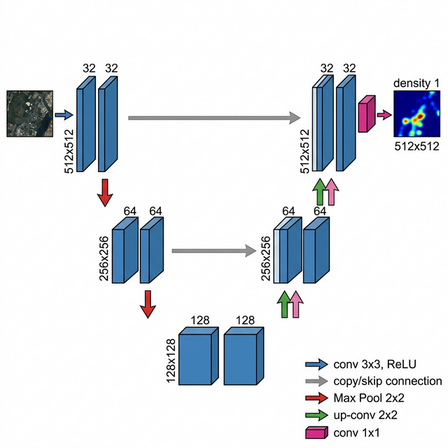
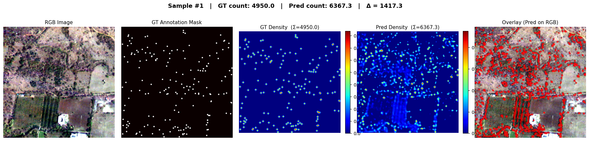
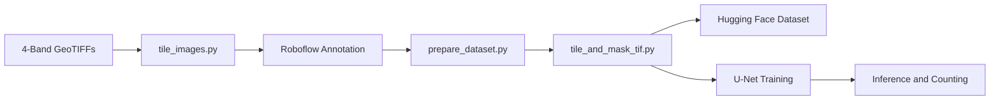

#  *Tree / Orchard Detection & Counting from High-Resolution Satellite Images*

## Overview

**Task:** Detect and count individual trees and orchards in very high-resolution satellite imagery using Machine Learning and Deep Learning.

A diversity of horticulture plantations is grown commercially. This project presents an end-to-end pipeline from raw 4-band GeoTIFF satellite imagery all the way to per-pixel density-map predictions to detect and count individual trees and orchards using a custom PyTorch U-Net trained with density map regression.

This project was built as part of the **GeoSpatial AI Challenge** held at **Visvesvaraya National Institute of Technology (VNIT), Nagpur**, where our team secured **2nd Runner Up**.

[Challenge Problem Statement (PDF)](https://drive.google.com/file/d/1tgW1oDeDR9paSjqYkhl8sEp1z28S2KL4/view)

## Team
 - [Harsh Shinde](https://github.com/HarshShinde0) - Lead
 - [Aditya Singh](https://github.com/Aditya-Singh-AIDS) - Member
 - [Ankit Kirtane](https://github.com/Tikna09) - Member
  
## Source Data

We started with two 4-band high-resolution satellite GeoTIFF images (Blue, Green, Red, NIR):

| Role  | File                          | Purpose                        |
|-------|-------------------------------|--------------------------------|
| Train | `tree_orchard_count_new0.tif` | Model training and annotation  |
| Test  | `tree_orchard_count_new1.tif` | Held-out evaluation and inference |

### Full-Scene RGB Previews

| Train Image (`tree_orchard_count_new0.tif`) | Test Image (`tree_orchard_count_new1.tif`) |
|:---:|:---:|
|  |  |

## Data Preparation Pipeline

### Step 1 - Tiling (`tile_images.py`)

The original GeoTIFFs are far too large to process or annotate directly. We use `tile_images.py` to slice them into manageable 512 x 512 patches with overlap.

| Parameter    | Value          |
|--------------|----------------|
| Tile size    | 512 x 512 px   |
| Overlap      | 128 px         |
| Band mapping | R = B3, G = B2, B = B1 |
| Output format| PNG            |
| Train tiles  | 153            |
| Test tiles   | 40             |

Images are split into `train/` and `test/` based on the `SPLIT_MAP` configuration.

#### Sample Tiles

| Train Tiles | Test Tiles |
|:---:|:---:|
|  |  |

### Step 2 - Annotation on Roboflow and Mask Creation (`prepare_dataset.py`)

The PNG tiles from Step 1 were uploaded to Roboflow for manual annotation.

<a href="https://universe.roboflow.com/hks-xjhbq/tree-orchard-detection">
    
</a>

- **Class annotated:** `tree` / `orchards`
- **Annotation type:** Bounding boxes around each individual tree/orchard
- **Export format:** Pascal VOC (XML)

Once downloaded, `prepare_dataset.py` reads the VOC XML files and generates binary segmentation / point masks:

- A small filled circle is drawn at each bounding-box center.
- This produces clean, non-overlapping point annotations ideal for density-map regression.

### Step 3 - GeoTIFF Re-Tiling with Metadata (`tile_and_mask_tif.py`)

To train on the full 4-band multispectral data (not just the visual RGB PNGs), we go back to the original GeoTIFFs.

- `tile_and_mask_tif.py` tiles the source images into 512 x 512 GeoTIFF tiles preserving:
  - All 4 spectral bands (B, G, R, NIR)
  - Geospatial metadata (CRS, affine transform)
- Simultaneously generates matching binary mask GeoTIFFs from the VOC XML bounding-box annotations.
- Tiles with less than 30% valid pixels are automatically skipped.

**Output structure:**

```
dataset/
├── image/
│   ├── train/   (153 tiles — 4-band GeoTIFF)
│   └── test/    (40 tiles  — 4-band GeoTIFF)
└── annotation/
    ├── train/   (153 masks — 1-band uint8 GeoTIFF)
    └── test/    (40 masks  — 1-band uint8 GeoTIFF)
```

## Dataset on Hugging Face

The complete processed dataset including the 4-band image tiles, point-mask annotation tiles, and the original full-scene TIF files has been published to Hugging Face.

**Dataset Link:** [harshinde/tree-orchard-detection](https://huggingface.co/datasets/harshinde/tree-orchard-detection)

## Model Architecture and Training

### Approach - Density Map Regression

Instead of traditional object detection, we use density map regression. Each point annotation is convolved with a Gaussian kernel (sigma = 2) to produce a smooth density map. The integral (pixel sum) of the predicted density map directly gives the tree count.

### U-Net Architecture

A lightweight 3-level U-Net built in PyTorch:
<p align="center">
  
</p>

### Training Sample Visualization

Below is a sample from the training set showing the RGB image, ground-truth mask, and the corresponding Gaussian density map:


### Training Curves


## Predictions and Results

### Prediction on Train Data



### Prediction on Test Data


Each prediction panel shows:

1. **Original RGB** - the input satellite tile rendered as true-color.
2. **Predicted Density Map** - heatmap where the sum gives the predicted tree count.
3. **Overlay** - predicted density heatmap blended on top of the original image, highlighting detected tree locations.

## Getting Started

### Prerequisites

- Python 3.10+
- CUDA-compatible GPU (recommended)

### Installation

```bash
cd code/src
pip install -r requirements.txt
```

### Train the Model

```bash
cd code/src
python train.py
```

The best model checkpoint (lowest validation MAE) is automatically saved to `best_model.pth`.

### Run Inference

```bash
cd code/src
python predict.py
```

This runs full-image inference on the target test GeoTIFF and outputs `inference_output.png` containing the RGB render, predicted density map, and an overlay visualization.

## Notebooks

| Notebook | Description |
|----------|-------------|
| `code.ipynb` | Complete end-to-end workflow - data loading, model definition, training, evaluation, and visualization |
| `inference.ipynb` | Load the pre-trained `best_model.pth` and run inference on any GeoTIFF - no training required |

## Pipeline Summary


